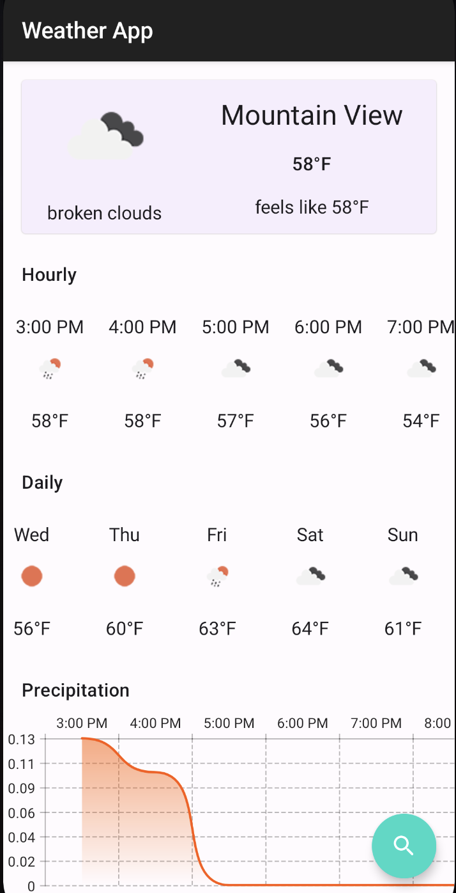

## Chase Mobile Project

**Build Instructions**

* Clone Project and Use Android Studio.

- Build in Android Studio. Should require nothing more out of the box.

**Features**

* Use the Fab button to search for cities
* Graph for precipitation in an area

I created GpsFragment in Java and have its functionality consumed by a CurrentWeather Kotlin
Fragment class. Although, being very comfortable with both Kotlin and Java. I decided to use
technologies that shows my competency using the greatest and latest the community has to offer.
Currently, I work with a codebase that has a lot of Java code written in. However, to fully utilize
Co-routines and Jetpack Compose, I had to adopt Kotlin for the majority of the project.

**Your Focus Areas.**

Software Architecture, Code Style, Readability, Robustness and using standard Android development
practices.

* Code Readability
* Dagger Hilt
* MVVM and unidirectional data flow
* Unit Tests
* Using persistence as a means of communications throughout the app.
* Jetpack Compose
* Navigation Component
* Kotlin gradle buildscripts
* Rotation works
* Heavy Coroutines workflow

**Copied-in code or copied-in dependencies.**

**What did I not focus on**

* Optimizing and creating different layouts for landscape or tablet configurations.

### Screenshots

<table>
    <tr>
        <td></img></td>
    </tr>
    <tr>
        <td align="center"><b>Horizontal</b></img></td>
    </tr>
</table>